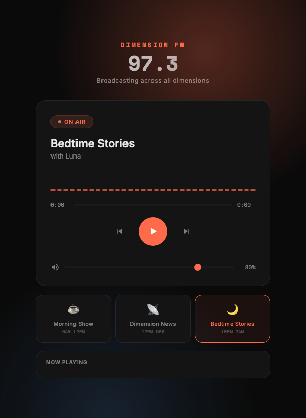

# Dimension FM

AI-powered radio station that generates shows with different formats throughout the day. Built with Dia TTS (Nari Labs) running locally on Apple Silicon via MLX.



## Shows

| Channel | Schedule | Hosts |
|---------|----------|-------|
| Morning Show | 6AM-12PM | Rick & Zara |
| Dimension News | 12PM-5PM | Anchor & Field Reporter |
| Bedtime Stories | 10PM-2AM | Luna |

Plus 6 fake interdimensional ads that play between segments (Knee Plus, Quantum Coffee, Memory Foam World, Swipe Infinity, Paradox Mutual, Ghost Wifi).

## Quick Start

```bash
# Activate the Python environment
source ~/dia-radio/bin/activate

# Start local server
cd ~/dia-radio && python3 -m http.server 8888

# Open player
open http://localhost:8888/web/
```

## Generate New Audio

```bash
source ~/dia-radio/bin/activate

# Generate a specific show
python scripts/generate_shows.py morning
python scripts/generate_shows.py ads
python scripts/generate_shows.py morning_ep2

# Generate all shows
python scripts/generate_shows.py all

# Generate SFX
python scripts/generate_static.py     # Channel switch static
python scripts/generate_jingle.py     # Bedtime piano jingle

# Post-process all audio (highpass, compression, loudness normalize)
python scripts/postprocess.py all     # Or: python scripts/postprocess.py bedtime
```

## Project Structure

```
dia-radio/
├── web/
│   └── index.html              # Radio player UI
├── scripts/
│   ├── generate_shows.py       # Show scripts + Dia TTS generation
│   ├── generate_static.py      # Channel switch static SFX
│   ├── generate_jingle.py      # Bedtime piano jingle
│   └── postprocess.py          # DSP chain (highpass, EQ, compression, LUFS)
├── audio/
│   ├── morning/                # 7 segments
│   ├── morning_ep2/            # 6 segments (merged into morning at runtime)
│   ├── news/                   # 6 segments
│   ├── bedtime/                # 6 segments
│   ├── ads/                    # 6 fake ad segments
│   └── sfx/                    # static.wav, bedtime_jingle.wav
└── ROADMAP.md
```

## Player Features

- **Playlist system** — auto-interleaves ads every 2 segments
- **Channel switching** — with radio static SFX
- **Bedtime jingle** — soft piano intro before stories
- **Volume control** — slider with mute toggle, persists to localStorage
- **Auto-advances** — plays through entire show seamlessly
- **Time-based default** — opens to the right show based on time of day

## Controls

| Key | Action |
|-----|--------|
| `Space` | Play/pause |
| `←` `→` | Prev/next segment |
| `↑` `↓` | Volume up/down |
| `1` `2` `3` | Switch channels |
| `M` | Mute/unmute |

## Tech Stack

- **TTS**: Dia 1.6B via mlx-audio (local, Apple Silicon)
- **DSP**: scipy, pyloudnorm (post-processing pipeline)
- **Frontend**: Vanilla HTML/CSS/JS
- **Model**: mlx-community/Dia-1.6B-fp16

## Post-Processing Pipeline

All audio runs through a DSP chain:
1. **High-pass 80Hz** — removes rumble
2. **Presence boost 4kHz +3dB** — clarity (skipped for bedtime)
3. **Broadcast compression** — 3:1 ratio, -20dB threshold (gentle 2:1 for bedtime)
4. **Loudness normalize** — -14 LUFS broadcast / -18 LUFS bedtime

Raw originals are backed up to `audio/*/raw/` before processing.
